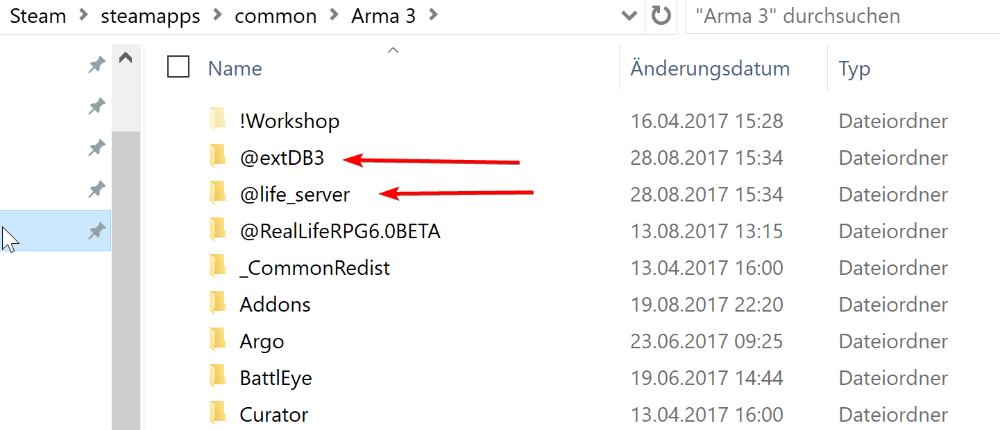
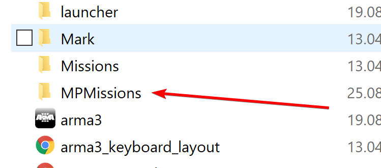
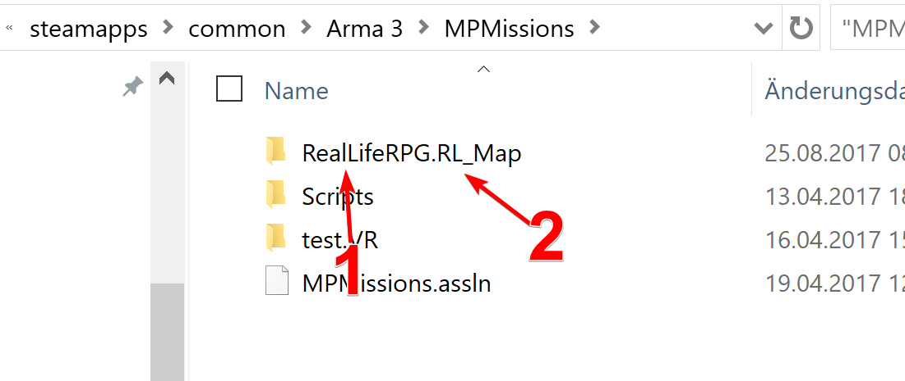

# [Tutorial] Lokal Testen

Ich möchte euch in diesem Tutorial erklären wie ihr lokal auf eurem Computer, ohne einen Testserver zu benötigen, eure Arma Mission testen könnt.

Ich werde es anhand der üblichen Life Mission erklären, prinzipiell funktioniert diese Vorgehensweise jedoch für alle erdenklichen Missionen.

### Wieso lokal Testen ?

Ein Testserver ist gut und auch für die Finalen tests bevor ein Feature in den Produktivbetrieb übernommen wir wichtig, wenn ihr jedoch dabei seit etwas neues zu entwickeln und schnell änderungen machen und testen wollt, seit ihr mit lokalem testen weitaus besser bedient.

### Arten von Lokalem Testen

Es gibt prinzipiell 2 verschiedene möglichkeiten wie ihr lokal testen könnt:

1. Ihr installiert auf eurem PC ganz normal (in einem extra Verzeichniss) einen Arma Server und startet ihn über die `arma3server(64).exe`
2. Ihr nutzt den Hosting modus des normalen Arma 3 Clients

Ich werde hier auf möglichkeit 2 eingehen, da ich sie selber gerne nutze und sie auch insgesamt verbreiteter ist in der Community, beide möglichkeiten funktionieren wunderbar und haben jeweils kleine vor und Nachteile.

### Einschränkungen beim lokalen Testen

Beim Lokalen Testen verhält sich Arma Teilweise anderes als auf einem Dedicated Server, da der Client (Spieler) gleich dem Server ist.

Daher kann es beim Testen von funtionen wie z.B. dem Smartphone schon mal zu schwierigkeiten kommen, deshalb ist es immer empfehlenswert Funktionen sobald sie fertig sind auf einem richtigen Server noch einmal komplett zu testen.

## Lokal Testen

Im allgemeinen Funktioniert die Installation so wie auch bei einem Dedicated Server.

### "Mods"

Ihr navigiert in euren normalen Arma 3 Ordner, der Pfad ist normalerweise sowas wie `C:\Program Files (x86)\Steam\steamapps\common\Arma 3`

Zunächst legt ihr die "Mods" `life_server` und `extDB3` (oder 2) an:

Wie auf dem normalen Server auch kommt in den `life_server` Ordner ein Ordner namens `addons` und darein dann die `life_server.pbo`.

Der `extDB3` oder `extDB2` Ordner kann einfach so genommen werden wie er vom Download aus [Torndeco's Repo](https://bitbucket.org/torndeco/extdb3/wiki/Home) kommt (hier muss später noch die Datenbank eingestellt werden, aber eins nach dem anderen).

### Mission

Die Mission kommt in den Ordner MPMissions (auch im Arma 3 Verzeichnis)

Dort kommt sie in einen Ordner der Zunächst den von euch gewählten Namen der Mission [1] (frei wählbar) und dann die Endung für eure Map [2] enthält.

In diesem fall ist die Endung `RL_Map` für unsere eigene Map, im Normalfall wird es sowas wie `Altis` oder `Stratis` o.ä. sein.

### Datenbank

Zum testen braucht ihr auch eine Datenbank, hierfür installiert ihr euch MySQL Server auf eurem PC und richtet eine Datenbank so ein, wie es für eure Mission notwendig ist (meist gibt es ein `*.sql` file was ihr einfach nur einspielen müsst).

Danach muss eure Datenbank nur noch in extDB eingestellt werden, hierfür einfach genau wie auf einem Server die IP, Username und Passwort eingeben.

Hostet ihr euren Datenbank Server auch lokal bei euch, könnt ihr als IP `127.0.0.1` eintragen.

### Testen

Startet ihr nun Arma 3 und geht im Hauptmenü auf `Multiplayer` und dort dann auf `Host`.

Jetzt müsst ihr ein mal bestätigen (die Settings für Spieler, Servername und Internet sind egal).

Im folgeden Bildschirm könnt ihr nun zunächst die Map die mit der Endung eurer Mission korespondier auswählen, danach sollte links eure Mission erscheinen.

Jetzt könnt ihr auf Spielen drücken und alles sollte wie von einem Server gewohnt funktionieren.

## Fehler

Sollten Fehler auftreten schaut vor allem auf den extDB log ob die Verbindung zur DB hergestellt werden konnte.